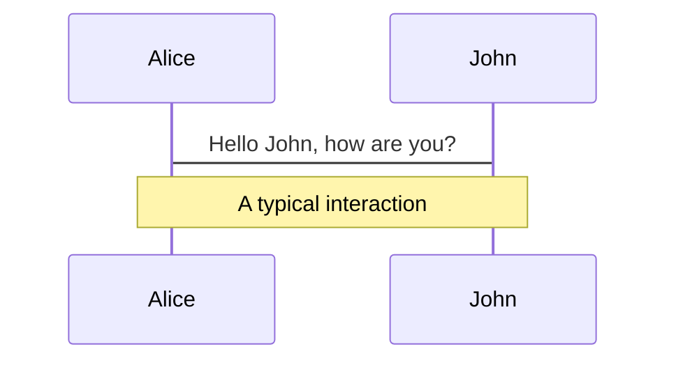
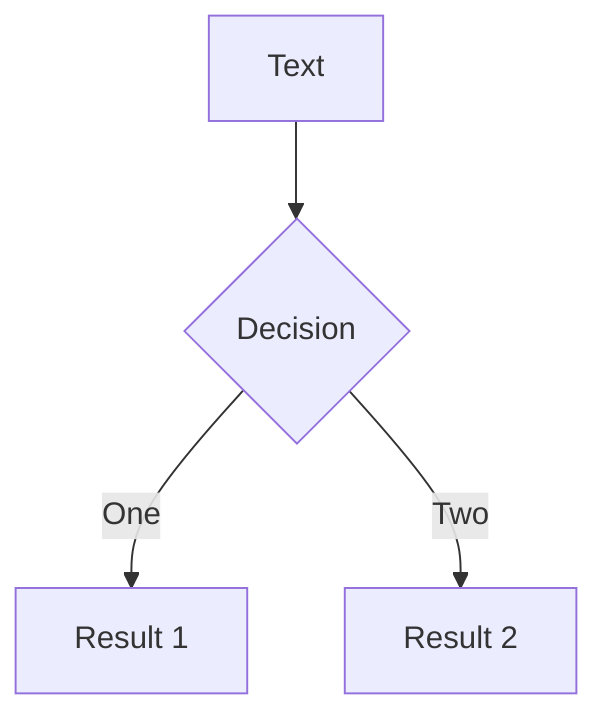
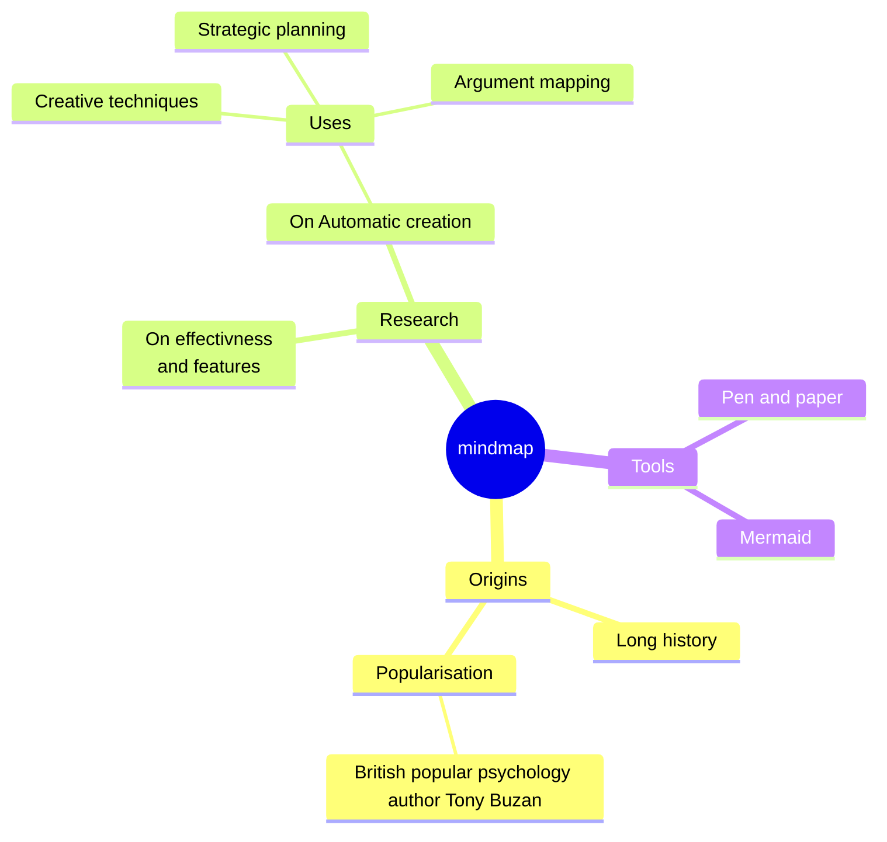
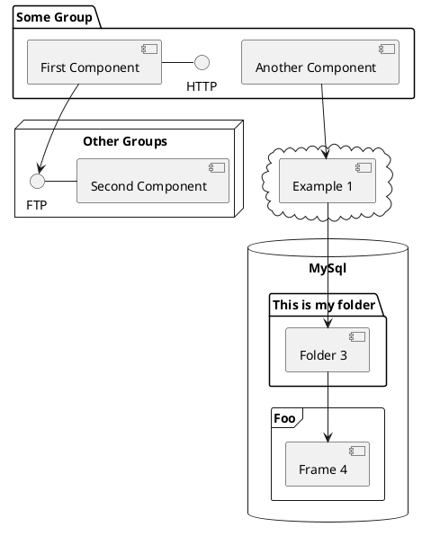

 IMPLEMENTASI SISTEM PEMBAYARAN DIGITAL (E-PAYMENT)
     PADA TRANSPORTASI BUS KOTA UNTUK SISWA
   MENGGUNAKAN RFID BERBASIS IOT ARDUINO ESP32
          (Studi Kasus : Kota Bandung)

Presentation slides for Skripsi

oleh : Aris (191351008)
<div class="pt-12">
  <span @click="$slidev.nav.next" class="px-2 py-1 rounded cursor-pointer" hover="bg-white bg-opacity-10">
    start <carbon:arrow-right class="inline"/>
  </span>
</div>

<div class="abs-br m-6 flex gap-2">
  <button @click="$slidev.nav.openInEditor()" title="Open in Editor" class="text-xl slidev-icon-btn opacity-50 !border-none !hover:text-white">
    <carbon:edit />
  </button>
  <a href="https://github.com/foxrider1998" target="_blank" alt="GitHub" title="Open in GitHub"
    class="text-xl slidev-icon-btn opacity-50 !border-none !hover:text-white">
    <carbon-logo-github />
  </a>
</div>

<!--
The last comment block of each slide will be treated as slide notes. It will be visible and editable in Presenter Mode along with the slide. [Read more in the docs](https://sli.dev/guide/syntax.html#notes)
-->

---
transition: slide-up
level: 2
---
# 📖Latar Belakang?

IMPLEMENTASI SISTEM PEMBAYARAN DIGITAL (E-PAYMENT) PADA TRANSPORTASI BUS KOTA UNTUK SISWA MENGGUNAKAN RFID BERBASIS IOT
ARDUINO ESP32

- 📝 **Perkembangan Internet of Things (IoT)** 
  di Indonesia mengalami pertumbuhan pesat, dengan Badan Siber dan Sandi Negara (BSSN) menyatakan bahwa pada 2021 pengguna IoT sudah lebih banyak daripada pengguna smartphone terkoneksi. Smart City, sebagai konsep menggunakan teknologi untuk mempermudah kegiatan masyarakat, khususnya dalam bidang transportasi,
- 🎨 **Kebutuhan Sistem** - berdasarkan observasi dan wawancara yang dilakukan pada 2 desember 2023 mendapatkan permasalahan dalam operasional bus kota sebagai alat transportasi siswa seperti waktu kedatangan bus yang tidak menentu dan interval waktu kedatangan bus sekitar 30 - 60 menit sehingga kurang diminati
- 🛠 **Penulis** - mengusung judul "IMPLEMENTASI SISTEM PEMBAYARAN DIGITAL (E-PAYMENT) PADA TRANSPORTASI BUS KOTA UNTUK SISWA MENGGUNAKAN RFID BERBASIS IOT ARDUINO ESP32," bertujuan memberikan kontribusi pada kemajuan mobilitas dan memanfaatkan RFID berbasis IoT.

<br>

---
transition: slide-up
level: 3
---
📖-Rumusan Masalah 
```ts {1-8|10-} twoslash
  `
 rumusan masalah yang di-
 ambil ialah bagaimana cara implementasi sistem 
 pembayaran elektronik (e-payment) pada transortasi
 bus-kota menggunakan RFID berbasis Arduino ESP32 
 sebagai perangkat pengendali?`
 

```
📖-Tujuan Penelitian
```ts {none|1-8} twoslash
 
 `
 Untuk merancang dan mengimplementasikan sistem
 pembayaran elektronik transportasi bus kota 
 menggunakan RFID berbasis Arduino ESP32` 

```

---
transition: slide-up
level: 3
---

# 📖 Batasan
```ts {all|1,2|1,3-4|1,5|1,6|all|none} twoslash
`
1. Sistem yang dibuat hanya terbatas pada penggunaan di bus kota dan tidak meliputi jenis transportasi lainnya. 
2. Sistem e-payment hanya berlaku untuk siswa sekolah yang terdaftar pada database sekolah dan memiliki kartu 
RFID yang sesuai.
3. Pengujian sistem mengunakan Black-box texting.
4. Sistem menggunakan dummy saldo sebagai pengganti payment gateway.
5. Sistem belum memiliki Concern pada keamanan cyber.
`
```
# 📖 Manfaat Penelitian
```ts {none|all|1,2-4|1,5-8|1,9-13|all} twoslash
`
1. Manfaat bagi Peneliti
  a. Menerapkan ilmu dan teori yang didapatkan selama proses perkuliahan dalam dunia pekerjaan.
  b. Menambah wawasan dan pengetahuan tentang IoT  dan penggunaan sensor RFID.

2. Manfaat bagi siswa
  a. Memudahkan pembayaran transportasi bus.
  b. Meningkatkan Kecepatan layanan Pembayaran.

3. Manfaat Bagi Keilmuan
  a. Sebagai bahan referensi dan memberikan edukasi pembelajaran untuk kedepanya agar bisa di kembangkan 
     lebih baik lagi.
  b. Menambah ilmu serta wawasan dalam bidang IoT  dan automasi pembayaran.


`
```


<style>
h1 {
  background-color: #2B90B6;
  background-image: linear-gradient(45deg, #4EC5D4 10%, #146b8c 20%);
  background-size: 100%;
  -webkit-background-clip: text;
  -moz-background-clip: text;
  -webkit-text-fill-color: transparent;
  -moz-text-fill-color: transparent;
}
</style>

<!--
Here is another comment.
-->
---
layout: quote
image: https://source.unsplash.com/collection/94734566/1920x1080
---

# 📖Tinjauan Pustaka

```ts {all|1,2|1,3-4|1,5|1,6|all|none} twoslash
`
Sistem pembayaran merupakan sistem yang berhubungan dengan pemindahan sejumlah nilai uang dari satu 
pihak ke pihak lain.

e-payment adalah proses pembayaran yang dilakukan secara elektronik melalui jaringan internet atau 
perangkat elektronik, seperti kartu kredit, debit, atau e-wallet.

transportasi adalah perpindahan orang atau barang dengan menggunakan alat atau kendaraan dari dan 
ke tempat-tempat yang terpisah secara geografis.

Bus kota merupakan alat transportasi jasa untuk mengangkut manusia dari suatu tempat ke tempat lain
 melalui jalan-jalan kelas satu di suatu kota. 

Radio-Frequency Identification (RFID) adalah teknologi yang menggunakan gelombang radio untuk 
mengidentifikasi secara otomatis terhadap suatu objek atau manusia baik secara jarak jauh maupun dekat.

IoT  adalah jaringan objek nyata yang saling terhubung dan berkomunikasi tanpa campur tangan manusia

Arduino ESP32 adalah board pengembangan yang menggunakan mikrokontroler ESP32. 


`
```


<style>
h1 {
  background-color: #ffff;
  background-image: linear-gradient(45deg, #4EC5D4 10%, #146b8c 20%);
  background-size: 100%;
  -webkit-background-clip: text;
  -moz-background-clip: text;
  -webkit-text-fill-color: transparent;
  -moz-text-fill-color: transparent;
}
</style>

<!--
Here is another comment.
-->
---
theme: seriph
layout: none
background: 'https://source.unsplash.com/1600x900/?nature,water'
---

# 📖Tinjauan Pustaka

```ts {all|1,2|1,3-4|1,5|1,6|all|none} twoslash
`
Agile software development merupakan sebuah cara yang dilakukan dalam pengembangan perangkat lunak dengan
sifat yang lincah dan cepat dan berbasis iterasi.

Flowmap adalah bagan-bagan yang mempunyai arus yang mengambarkan langkah-langkah penyelesaian suatu masalah.

Unified Modelling Language (UML) adalah sebuah bahasa yang telah menjadi standar dalam industri untuk	
visualisasi, merancang dan mendokumentasikan sistem perangkat lunak.

Use case adalah deskripsi sebuah sistem dari perspektif pengguna. Use case bekerja dengan cara mendeskripsikan 
tipikal interaksi antar pengguna sebuah sistem dengan sistemnya sendiri melalui sebuah cerita bagaimana sebuah 
sistem dapat di pakai. 

Activity  Diagram adalah teknik untuk mengambarkan logika procedural proses bisnis dan aliran kerja dalam banyak 
kasus. 

Sequence Diagram merupakan interaksi Diagram yang di gunakan untuk menjelaskan eksekusi sebuah skenario semantik.

Black box testing adalah pengujian yang dilakukan hanya mengamati hasil eksekusi melalui data uji dan memeriksa 
fungsional dari perangkat lunak. 


`
```


<style>
h1 {
  background-color: #ffff;
  background-image: linear-gradient(45deg, #4EC5D4 10%, #146b8c 20%);
  background-size: 100%;
  -webkit-background-clip: text;
  -moz-background-clip: text;
  -webkit-text-fill-color: transparent;
  -moz-text-fill-color: transparent;
}
</style>

<!--
Here is another comment.
-->

---
layout: default
---

# Table of contents

```html
<Toc minDepth="1" maxDepth="1"></Toc>
```

<Toc maxDepth="1"></Toc>


---
transition: slide-up
level: 2
---

# Navigation

Hover on the bottom-left corner to see the navigation's controls panel, [learn more](https://sli.dev/guide/navigation.html)

## Keyboard Shortcuts

|     |     |
| --- | --- |
| <kbd>right</kbd> / <kbd>space</kbd>| next animation or slide |
| <kbd>left</kbd>  / <kbd>shift</kbd><kbd>space</kbd> | previous animation or slide |
| <kbd>up</kbd> | previous slide |
| <kbd>down</kbd> | next slide |

<!-- https://sli.dev/guide/animations.html#click-animations -->

<p v-after class="absolute bottom-23 left-45 opacity-30 transform -rotate-10">Here!</p>

---
layout: image-right
image: https://source.unsplash.com/collection/94734566/1920x1080
---

# Code

Use code snippets and get the highlighting directly, and even types hover![^1]

```ts {all|5|7|7-8|10|all} twoslash
// TwoSlash enables TypeScript hover information
// and errors in markdown code blocks
// More at https://shiki.style/packages/twoslash

import { computed, ref } from 'vue'

const count = ref(0)
const doubled = computed(() => count.value * 2)

doubled.value = 2
```

<arrow v-click="[4, 5]" x1="350" y1="310" x2="195" y2="334" color="#953" width="2" arrowSize="1" />

<!-- This allow you to embed external code blocks -->
<<< @/snippets/external.ts#snippet

<!-- Footer -->
[^1]: [Learn More](https://sli.dev/guide/syntax.html#line-highlighting)

<!-- Inline style -->
<style>
.footnotes-sep {
  @apply mt-5 opacity-10;
}
.footnotes {
  @apply text-sm opacity-75;
}
.footnote-backref {
  display: none;
}
</style>

---

# Components

<div grid="~ cols-2 gap-4">
<div>

You can use Vue components directly inside your slides.

We have provided a few built-in components like `<Tweet/>` and `<Youtube/>` that you can use directly. And adding your custom components is also super easy.

```html
<Counter :count="10" />
```

<!-- ./components/Counter.vue -->
<Counter :count="10" m="t-4" />

Check out [the guides](https://sli.dev/builtin/components.html) for more.

</div>
<div>

```html
<Tweet id="1390115482657726468" />
```

<Tweet id="1390115482657726468" scale="0.65" />

</div>
</div>

<!--
Presenter note with **bold**, *italic*, and ~~striked~~ text.

Also, HTML elements are valid:
<div class="flex w-full">
  <span style="flex-grow: 1;">Left content</span>
  <span>Right content</span>
</div>
-->

---
class: px-20
---

# Themes

Slidev comes with powerful theming support. Themes can provide styles, layouts, components, or even configurations for tools. Switching between themes by just **one edit** in your frontmatter:

<div grid="~ cols-2 gap-2" m="t-2">

```yaml
---
theme: default
---
```

```yaml
---
theme: seriph
---
```


</div>

Read more about [How to use a theme](https://sli.dev/themes/use.html) and
check out the [Awesome Themes Gallery](https://sli.dev/themes/gallery.html).

---
preload: false
---

# Animations

Animations are powered by [@vueuse/motion](https://motion.vueuse.org/).

```html
<div
  v-motion
  :initial="{ x: -80 }"
  :enter="{ x: 0 }">
  Slidev
</div>
```

<div class="w-60 relative mt-6">
  <div class="relative w-40 h-40">
    
    
    
  </div>

  <div
    class="text-5xl absolute top-14 left-40 text-[#2B90B6] -z-1"
    v-motion
    :initial="{ x: -80, opacity: 0}"
    :enter="{ x: 0, opacity: 1, transition: { delay: 2000, duration: 1000 } }">
    Slidev
  </div>
</div>

<!-- vue script setup scripts can be directly used in markdown, and will only affects current page -->
<script setup lang="ts">
const final = {
  x: 0,
  y: 0,
  rotate: 0,
  scale: 1,
  transition: {
    type: 'spring',
    damping: 10,
    stiffness: 20,
    mass: 2
  }
}
</script>

<div
  v-motion
  :initial="{ x:35, y: 40, opacity: 0}"
  :enter="{ y: 0, opacity: 1, transition: { delay: 3500 } }">

[Learn More](https://sli.dev/guide/animations.html#motion)

</div>

---

# LaTeX

LaTeX is supported out-of-box powered by [KaTeX](https://katex.org/).

<br>

Inline $\sqrt{3x-1}+(1+x)^2$

Block
$$ {1|3|all}
\begin{array}{c}

\nabla \times \vec{\mathbf{B}} -\, \frac1c\, \frac{\partial\vec{\mathbf{E}}}{\partial t} &
= \frac{4\pi}{c}\vec{\mathbf{j}}    \nabla \cdot \vec{\mathbf{E}} & = 4 \pi \rho \\

\nabla \times \vec{\mathbf{E}}\, +\, \frac1c\, \frac{\partial\vec{\mathbf{B}}}{\partial t} & = \vec{\mathbf{0}} \\

\nabla \cdot \vec{\mathbf{B}} & = 0

\end{array}
$$

<br>

[Learn more](https://sli.dev/guide/syntax#latex)

---

# Diagrams

You can create diagrams / graphs from textual descriptions, directly in your Markdown.

<div class="grid grid-cols-4 gap-5 pt-4 -mb-6">









</div>

[Learn More](https://sli.dev/guide/syntax.html#diagrams)

---
src: ./pages/multiple-entries.md
hide: false
---

---
layout: center
class: text-center
---

# Learn More

[Documentations](https://sli.dev) · [GitHub](https://github.com/slidevjs/slidev) · [Showcases](https://sli.dev/showcases.html)
